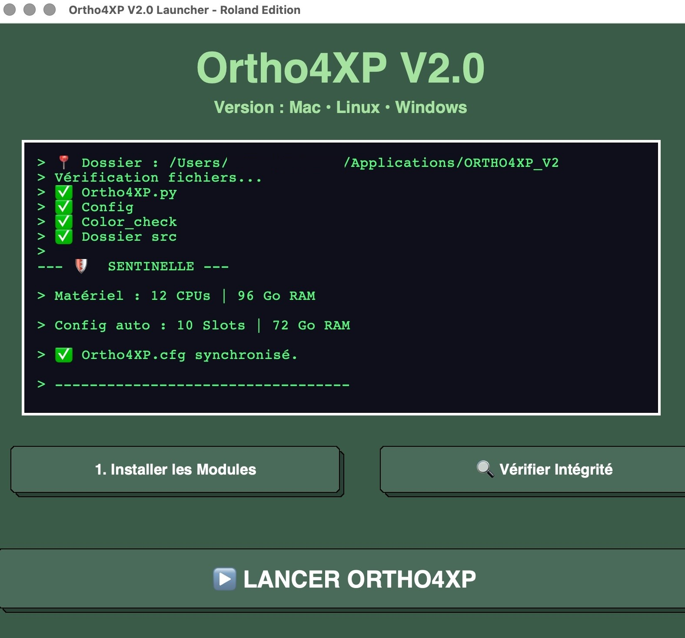
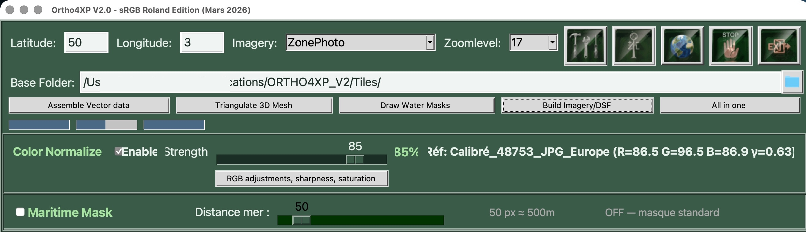
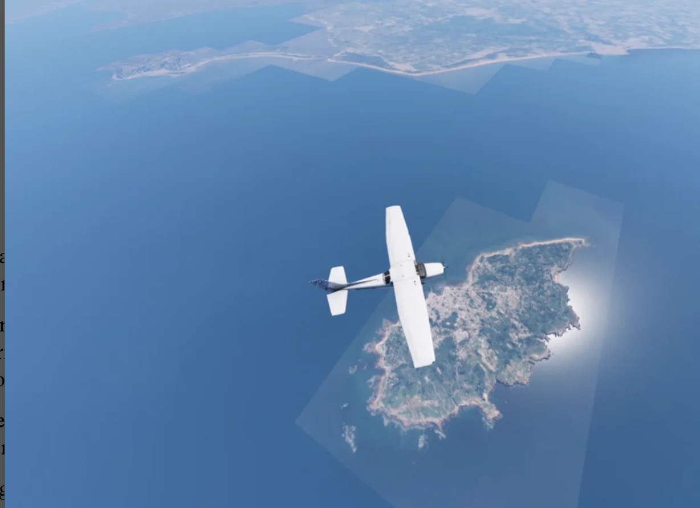

Voici une version optimisée, propre et structurée pour votre fichier `README.md`. J'ai fusionné vos dernières corrections techniques avec la structure de présentation pour un rendu professionnel sur GitHub.

---

## 📖 LISEZ-MOI - Ortho4XP_V2.0 🌍

**Évolution moderne avec installation automatique sans terminal.** Développé par **Ypsos**, basé sur la version **ORTHO4XP_1.40 Master** originale d'**Oscar Pilote**.

---

## 🚀 Pourquoi cette version V2.0 ?

L'objectif de ce projet est de lever définitivement la barrière technique du terminal. Cette version simplifie radicalement l'expérience utilisateur tout en conservant la puissance et la précision de l'outil original.

### ✨ Les points forts
* **📦 Zéro Terminal :** Installation et lancement entièrement automatisés (scripts dédiés).
* **🖱️ Accessibilité :** Conçu pour les simmers qui veulent créer leurs tuiles sans avoir à manipuler de code.
* **🛠️ Fiabilité :** Reprise de la base solide 1.40 Master avec des optimisations modernes et un environnement Python isolé.

---

## ⚡ Nouveautés & Optimisations techniques

* **Performance :** Moteur sous Python 3.12 (gain de **15-20%** de vitesse), optimisé pour ARM64/Pillow et gestion de 10 slots de conversion.
* **Stabilité :** "Sentinelle" intégrée pour monitorer le CPU et la RAM (limitation automatique à 75% pour éviter les plantages).
* **Colorimétrie Avancée :** Calibration sur 48 753 JPG, normalisation en mémoire et fondu RGB progressif pour des transitions invisibles entre les sources.
* **Masquage Maritime :** Option de reconstruction de masques en mer pour un rendu côtier naturel.
* **Zones Sensibles :** Reconstruction des zones floutées ou masquées par interpolation des JPG voisins, évitant les zones grises ou floues.
* **Gestion des Frontières :** Amélioration des limites administratives et frontalières pour un dégradé colorimétrique harmonieux.

---

## 🛠 Utilisation Rapide

1.  **Consultez** impérativement le fichier [AVERTISSEMENT_LICENCE_LEGAL.md](./AVERTISSEMENT_LICENCE_LEGAL.md).
2.  **Téléchargez** le dépôt (Download ZIP ou Git Clone).
3.  **Lancez** l'exécutable ou le script d'installation automatique (`.app`, `.vbs` ou `.desktop` selon votre OS).

---

## 📜 Crédits

* **Concept & Design :** Roland (Ypsos)
* **Codage & Support :** Claude (Anthropic AI) & Gemini (Google AI)
* **Travaux originaux :** Oscar Pilote ([Ortho4XP](https://github.com/oscarpilote/Ortho4XP))
* **Adaptation & Maintenance 1.40 :** Fork par **Shred86** ([Lien GitHub](https://github.com/shred86/Ortho4XP))

---
*Distribué sous licence GNU GPL v3.*

---
## 🖥️ Nouvelles Interfaces Graphiques (V2.0)

### Installation et Lanceur

### Interface Principale et Color Check

---

## 🌊 Comparaison des Masques Maritimes

| Sans Masque (Ancien) | Masque Automatique (V2.0) |
| :---: | :---: |
|  |  |
