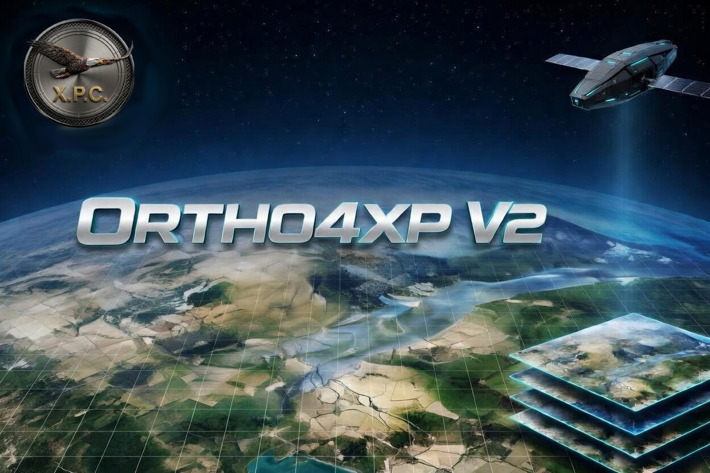

  

  <h1>ORTHO4XP V2.0</h1>
  
<strong>La version moderne d'Ortho4XP</strong> 
  Installation automatique • Sans terminal • Pour X-Plane 12

   
  

---

## 🧭 Origine du projet

| | |
|---|---|
| **Logiciel original** | Créé par Oscar Pilote → [github.com/oscarpilote/Ortho4XP](https://github.com/oscarpilote/Ortho4XP) |
| **Version 1.40 maintenue** | Fork par Shred86 → [github.com/shred86/Ortho4XP](https://github.com/shred86/Ortho4XP) |
| **Cette V2** | Refonte complète par **Roland (Ypsos)** avec **Claude (Anthropic AI)** |

En mars 2026, j'ai contacté Oscar Pilote et la communauté (Issue GitHub #299, Topic X-Plane.org).  
Réponse : *« Tu fais ce que tu veux, tu es libre »*.  
Cet espace a été créé afin que la version V2 soit **claire, indépendante et accessible à tous**.

---

## ⚡ Tableau comparatif — V1.40 vs V2

| Fonctionnalité | Ortho4XP 1.40 (Shred86) | **Ortho4XP V2 (Roland)** |
|---|---|---|
| **Installation** | Scripts bash/bat manuels dans le terminal | ✅ Launcher graphique — 1 clic, aucun terminal |
| **Python** | Non géré automatiquement | ✅ Python 3.12 détecté et installé automatiquement |
| **Environnement** | Dépendances sur le système hôte | ✅ Environnement isolé `venv/` — système intact |
| **Compatibilité** | macOS Intel, Windows | ✅ Apple Silicon M1–M4, Intel, Windows 10/11, Linux |
| **Performance** | Python 3.x standard | ✅ Python 3.12 — 15 à 20% plus rapide sur les calculs mesh |
| **Détection matériel** | Manuelle | ✅ Sentinelle CPU/RAM — slots sécurisés automatiques |
| **Lancement** | Terminal obligatoire | ✅ Lanceur natif `.app` / `.vbs` / `.desktop` |
| **Interface** | Fenêtre standard | ✅ Interface adaptée 4K — polices agrandies automatiquement |
| **GDAL / rasterio** | osgeo.gdal (dépendance système) | ✅ `rasterio` dans venv — 100% autonome |
| **Transparence eau XP12** | Non géré — tuiles BC1 opaques | ✅ Transparence native XP12 — textures BC3 avec canal alpha |
| **Masques côtiers** | Manuel uniquement | ✅ Génération automatique depuis le mesh |
| **Color Normalize** | Absent | ✅ Correction colorimétrique automatique vers sRGB neutre |
| **Color Check** | Absent | ✅ Interface de vérification et correction des couleurs |
| **Previews** | Basique | ✅ Outil Previews avec curseurs et configuration visuelle |
| **Portabilité** | Lié au système | ✅ Dossier autonome — déplaçable sur disque externe |
| **Validation XP12** | Non testée spécifiquement | ✅ Tuiles produites et validées dans X-Plane 12 |

---

## 🚀 Pourquoi ORTHO4XP V2 ?

L'objectif est de lever définitivement la barrière technique du terminal. Cette version simplifie radicalement l'expérience utilisateur tout en conservant la puissance de l'outil original.

### ✨ Les points forts

- 📦 **Zéro Terminal** — Installation et lancement entièrement automatisés
- 🖱️ **Accessibilité** — Conçu pour les simmers qui veulent créer leurs tuiles sans manipuler de code
- 🛠️ **Fiabilité** — Base solide 1.40 avec optimisations modernes et environnement Python isolé
- 🌊 **Eau transparente XP12** — Masques côtiers automatiques depuis le mesh
- 🎨 **Colorimétrie avancée** — Normalisation sRGB et correction visuelle par tuile

---

## 🖥️ Interfaces graphiques V2.0

### Installation et Lanceur

### Interface principale et Color Check

---

## 🛠 Utilisation rapide

1. Consultez impérativement le fichier `AVERTISSEMENT_LICENCE_LEGAL.md`
2. Téléchargez le dépôt — **Download ZIP**
3. Décompressez l'archive
4. Renommez le dossier en `ORTHO4XP_V2`

> **⚠️ Mac uniquement** : Placez le dossier `ORTHO4XP_V2` dans votre dossier **`/Users/votre_nom/Applications/`** avant de lancer — le lanceur ne fonctionnera pas depuis le Bureau ou les Téléchargements.

5. Double-cliquez sur `Lanceur_Installation_Prerequis.app` (Mac) / `Lanceur_Installation_Prerequis.vbs` (Windows) / `Lanceur_Installation_Prerequis.sh` (Linux)

---

## 📜 Crédits

| | |
|---|---|
| **Concept & Design** | Roland (Ypsos) |
| **Codage & Support** | Claude (Anthropic AI) |
| **Travaux originaux** | Oscar Pilote (Ortho4XP) |
| **Adaptation 1.40** | Shred86 |

---

## ⚠️ Licence

Distribué sous **GNU GPL v3** dans le respect de la licence du projet original.  
Voir `AVERTISSEMENT_LICENCE_LEGAL.md` pour les détails complets.
